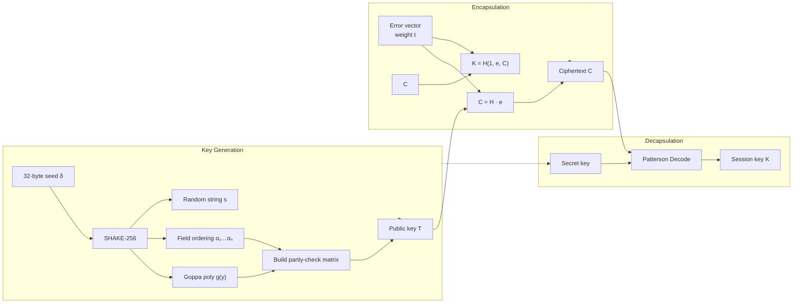
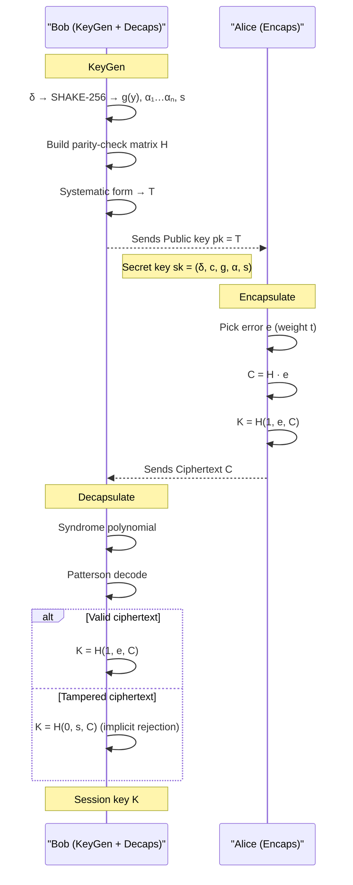
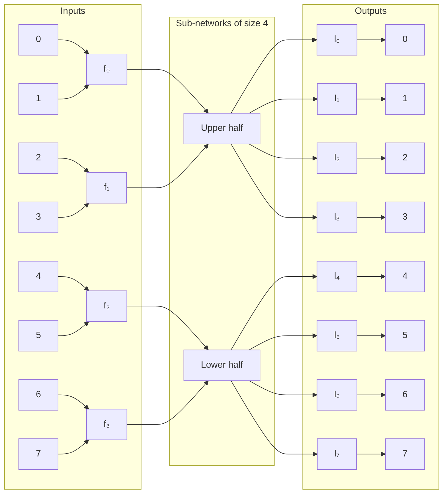
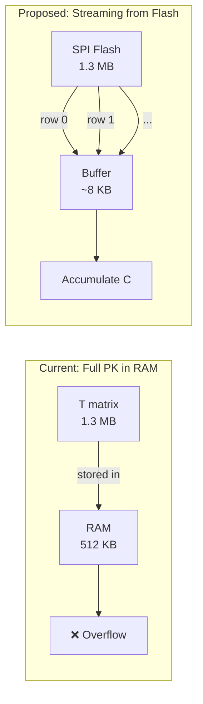

<script> MathJax = { tex: { inlineMath: [['$', '$'], ['\\(', '\\)']] } }; </script> <script id="MathJax-script" async src="https://cdn.jsdelivr.net/npm/mathjax@3/es5/tex-chtml.js"> </script>

# Implementing PQC: Building Classic McEliece in Rust

In this post, I will talk about my implementation of the Classic McEliece cryptosystem and the challenges I came across during my work.


1. [Introduction](#introduction)
   - [Why Classic McEliece?](#why-classic-mceliece)
   - [Source Code](#source-code)
2. [The Implementation; The Math is Only Half the Challenge](#the-implementation-the-math-is-only-half-the-challenge)
   - [Goppa Codes](#goppa-codes)
   - [Key Generation, Encapsulation and Decapsulation](#key-generation-encapsulation-and-decapsulation)
   - [Why Rust?](#why-rust)
3. [Galois Field and Polynomial Arithmetic: A Mathematician's View](#galois-field-and-polynomial-arithmetic-a-mathematicians-view)
   - [Addition](#addition)
   - [Multiplication](#multiplication)
   - [Squaring and Square Root](#squaring-and-square-root)
   - [Inversion](#inversion)
   - [Polynomials](#polynomials)
4. [Constant-Time: Sometimes the Slow Path is the Safest](#constant-time-sometimes-the-slow-path-is-the-safest)
   - [The Patterns Used](#the-patterns-used)
   - [Proving It With dudect](#proving-it-with-dudect)
   - [What Constant-Time Costs](#what-constant-time-costs)
5. [Testing and Verification](#testing-and-verification)
6. [The Spec Has Sharp Edges](#the-spec-has-sharp-edges)
   - [The Benes Network (Control Bits)](#the-benes-network-control-bits)
7. [What's Still Left](#whats-still-left)
8. [Future Plans: Streaming Public Key Architecture](#future-plans-streaming-public-key-architecture)
9. [Lessons Learned](#lessons-learned)
10. [Some Papers Worth Reading](#some-papers-worth-reading)

## Introduction

### Why Classic McEliece?

Ever since Peter Shor demonstrated that quantum computers could break RSA and ECC algorithms in polynomial time [[Shor, Peter W.]](https://doi.org/10.1137/S0036144598347011), the cryptography community has been racing to find quantum-resistant alternatives.

To lead this effort, NIST launched a massive initiative in 2017 to standardize Post-Quantum Cryptography (PQC) [[NIST]](https://csrc.nist.gov/Projects/post-quantum-cryptography/Post-Quantum-Cryptography-Standardization/Call-for-Proposals). After several rigorous rounds of evaluation, NIST announced the Round 3 candidates in July 2020, narrowing the field down to just four primary finalists and five alternates for public-key encryption and key establishment [[NIST]](https://csrc.nist.gov/News/2020/pqc-third-round-candidate-announcement).


*PQC standardization milestones from NIST's initial call through to published FIPS standards. Classic McEliece advanced through multiple rounds as an alternate candidate.*

One of those top four finalists is [**Classic McEliece**](https://classic.mceliece.org). It is an IND-CCA2 secure Key Encapsulation Mechanism (KEM) built on the original 1978 McEliece cryptosystem, the very first code-based cryptographic scheme [[R. J. McEliece]](https://tmo.jpl.nasa.gov/progress_report2/42-44/44N.PDF). While the original design is foundational, modern KEM constructions in this family typically use its twin, the **Niederreiter construction**, which cleverly reduces the encryption process down to a highly efficient syndrome calculation.

What makes this system stand out is its incredible track record. It has survived decades of cryptanalysis without being broken, making it one of the most confidence-inspiring options available today. Its reliability is so well-regarded that Germany's Federal Office for Information Security (BSI) has explicitly recommended it (alongside the alternate candidate [FrodoKEM](https://frodokem.org/)) for long-term data protection [[BSI]](https://www.bsi.bund.de/SharedDocs/Downloads/EN/BSI/Publications/TechGuidelines/TG02102/BSI-TR-02102-1.pdf?__blob=publicationFile&v=10).

But this rock-solid security comes with a trade-off: the public keys are massive. Ranging from 255 KB to over 1.3 MB, they are far too heavy for dynamic, bandwidth-sensitive environments like TLS handshakes. However, this makes the scheme perfectly suited for specific use cases where keys can be pre-loaded, like long-term document encryption, smart cards, and IoT embedded systems.


*Public key sizes of Classic McEliece compared to RSA-2048 and Kyber-1024 (logarithmic scale). McEliece's keys are 200–5000× larger, but the ciphertexts are tiny.*

### Source Code

The source code of our implementation is available at [github.com/batt0s/mceliece_rs](https://github.com/batt0s/mceliece_rs). The source code is under the MIT License.

## The Implementation; The Math is Only Half the Challenge

### Goppa Codes

Each secret key of Classic McEliece defines a length-n binary Goppa code

$$
\Gamma_2(g, \alpha_1, \dots, \alpha_n) = \{ c \in \mathbb{F}_2^n \mid \sum_i c_i / (x - \alpha_i) \equiv 0 \bmod g \},
$$

where $g \in \mathbb{F}_{2^m}[x]$ is a degree-$t$ monic irreducible polynomial and $\alpha_1,..., \alpha_n$ is a list of distinct elements in $\mathbb{F}_{2^m}$ with $g(\alpha_i) \ne 0$ for all $i$. The dimension of $\Gamma_2(g, \alpha_1, ..., \alpha_n)$ is given by $k = n - mt$, and the code is designed to be able to correct $t$ errors. The systematic parity-check matrix code forms the **public key**. In encapsulation, an error vector is generated and the syndrome of the error vector is computed as the **ciphertext**. The **session key** is the hash value of the error vector. With the **secret key**, decapsulation recovers the error vector using a decoder and derives the session key. The following table shows parameters $m,n,t$ and the sizes of the public keys, secret keys, and ciphertexts in bytes for all 10 parameter sets.

|                  | $m$ | $n$  | $t$ | level | public key | secret key | ciphertext |
| ---------------- | --- | ---- | --- | ----- | ---------- | ---------- | ---------- |
| mceliece348864*  | 12  | 3488 | 64  | 1     | 261 120    | 6492       | 128        |
| mceliece460896*  | 13  | 4608 | 96  | 3     | 524 160    | 13 608     | 188        |
| mceliece6688128* | 13  | 6688 | 128 | 5     | 1 044 992  | 13 932     | 240        |
| mceliece6960119* | 13  | 6960 | 119 | 5     | 1 047 319  | 13 948     | 226        |
| mceliece8192128* | 13  | 8192 | 128 | 5     | 1 357 824  | 14 120     | 240        |



An f parameter set (say mceliece348864f) and the corresponding non-f parameter set (say mceliece348864) differ only in the key generation algorithm: f parameter sets generate a new secret key when the code does not have a systematic parity-check matrix, while non-f parameter sets only generate a new secret key when a systematic parity-check matrix cannot be obtained even after permuting a small set of columns.

### Key Generation, Encapsulation and Decapsulation

Let's walk through each operation at a high level, following the NIST specification.

**Key Generation** is the most complex operation. Given a 32-byte seed $\delta$ (`delta`):

1. Derive the randomness using SHAKE-256 to produce the field ordering seed, the Goppa polynomial seed, and the random string $s$.
2. Generate the field ordering $\alpha_1, ..., \alpha_n$ by sorting a list of SHAKE-256 outputs and bit-reversing the indices (this produces a pseudorandom permutation of the field elements).
3. Generate the Goppa polynomial $g(y)$, a monic irreducible polynomial of degree $t$, by interpreting the randomness as a sequence of bits and applying the Berlekamp trace algorithm to find an irreducible.
4. Build the parity-check matrix of the Goppa code and apply Gaussian elimination to put it in systematic form. The systematic matrix $T$(of size $mt \times k$ bits) becomes the **public key**.
5. If the matrix doesn't have full rank, retry with a fresh seed. For "f" parameter sets, also try permuting a small set of columns before retrying.

**Encapsulation** is the public operation. Given a public key `pk`:

1. Generate a random error vector $e$ of length $n$ with exactly $t$ ones (Hamming weight $t$). This uses rejection sampling on random field elements.
2. Compute the syndrome $C = H \cdot e$ where $H = [T | I]$ is the parity-check matrix. This is a matrix-vector product over $GF(2)$: $C = e_0 \oplus (T \cdot e_1)$, splitting $e$ into its first $k$ and last $mt$ bits.
3. Derive the session key $K = H(1, e, C)$ using SHAKE-256.
4. Return $(C, K)$, the ciphertext and session key.

**Decapsulation** is the private operation. Given a ciphertext $C$ and the secret key `sk`:

1. Compute the syndrome polynomial from $C$ and evaluate it at each $\alpha_i$ to get the error vector.
2. Apply the Patterson decoding algorithm: compute the error locator polynomial $\sigma(y)$ via Berlekamp-Massey, find its roots via Chien search, and recover the error support.
3. If decoding succeeds, use the recovered error vector $e$. If decoding fails (tampered ciphertext), use the private key's $s$ string instead, this is **implicit rejection**, which prevents attackers from distinguishing valid from invalid ciphertexts by timing.
4. Derive the session key $K = H(b, e, C)$ where $b$ indicates success or failure.

The crucial detail in step 3 is that the choice between `e` and `s` is made with `subtle::conditional_select`, a branchless operation that executes both paths and selects the result. This is what keeps decapsulation constant-time.



*Protocol flow: Bob generates a key pair and sends the public key to Alice. Alice encapsulates a session key and sends the ciphertext back. Bob decapsulates using his secret key. If the ciphertext is invalid, Bob derives the key from `s` instead — this implicit rejection is what keeps decapsulation constant-time.*

### Why Rust?

Cryptographic implementations have two jobs: be correct, and don't leak secrets. Rust helps with both.

**Memory safety without garbage collection.** In C, buffer overflows and use-after-free are the bread and butter of security vulnerabilities. Classic McEliece deals with large packed arrays (the public key matrix is over a million bits), and getting the indexing right is error-prone. Rust's borrow checker eliminates entire classes of memory bugs at compile time, without the unpredictability of a GC.

**Constant-time primitives on day one.** Rust's `subtle` crate provides `Choice`, `ConditionallySelectable`, and `ConstantTimeEq`, the building blocks for branchless crypto. These types are designed so you can't accidentally branch on a secret: `Choice` cannot be converted to `bool` without an explicit `.unwrap_u8()`, which makes data-dependent branches visible during code review.

**Fearless refactoring.** Cryptographic code often needs to be rewritten for performance or security reasons. The type system catches mismatched field sizes (using const generics like `GF<13>` vs `GF<12>`), wrong array lengths, and incorrect constant-time operations before they reach production.

**But Rust doesn't make you constant-time.** The compiler can still optimize away your careful branchless code. You must verify. We'll get to that.

## Galois Field and Polynomial Arithmetic: A Mathematician's View

Since I'm a mathematician at heart, this was my favourite part of the implementation. Classic McEliece operates over the finite field $GF(2^m)$ with $m=12$ or $m=13$, represented as polynomials modulo an irreducible polynomial $f(z)$ of degree $m$. A field element $a \in GF(2^m)$ is stored as a bitmask in a `u16`, where bit `i` is the coefficient of $z^i$.

### Addition

In characteristic 2, addition is simply XOR; there is no carry. This is embarrassingly fast and trivially constant-time.

```
    a = 0b1011011001011
    b = 0b0110101110010
    a ⊕ b = 0b1101110111001
```

```rust
impl<const M: u8> Add for GF<M> {
    type Output = Self;
    fn add(self, rhs: Self) -> Self {
        GF(self.0 ^ rhs.0)
    }
}
```

### Multiplication

Multiplication is where the real work happens. It proceeds in two phases: **polynomial multiplication** (carry-less product) followed by **modular reduction**.

```rust
fn mul(self, rhs: Self) -> Self {
    let mut res: u32 = 0u32;
    let m_mask = (1 << M) - 1;
    let a = (self.0 as u32) & m_mask;
    let b = (rhs.0 as u32) & m_mask;

    // Polynomial multiplication a(x) · b(x)
    for i in 0..M {
        let bit = (a >> i) & 1;
        let mask = 0u32.wrapping_sub(bit); // all-ones if bit==1, all-zeros if bit==0
        res ^= (b << i) & mask;
    }

    // Reduction modulo the irreducible polynomial p(x)
    let poly = Self::get_irreducible_poly();
    for i in (M..=(2 * M - 1)).rev() {
        let bit = (res >> i) & 1;
        let mask = 0u32.wrapping_sub(bit);
        res ^= (poly << (i - M)) & mask;
    }

    GF((res & m_mask) as u16)
}
```

The polynomial multiplication loop is essentially a shift-and-add (XOR) algorithm. For each set bit in `a`, we XOR a shifted copy of `b` into the accumulator. The branchless mask trick (`0u32.wrapping_sub(bit)`) ensures the loop executes identically regardless of the data, satisfying the constant-time requirement. The reduction loop works the same way: for each high-degree bit, we conditionally XOR a shifted copy of the irreducible polynomial.

```
       1011   (a)
    ×  0110   (b)
    ---------
       0000   (bit 0 of b)
      1011    (bit 1, shifted ←1)
     1011     (bit 2, shifted ←2)
    0000      (bit 3, shifted ←3)
    ---------
    0100010   (XOR of all rows)
```

Then the reduction step:

```
    Raw product:  0100010  (degree 5)
    Irreducible:  100101   (degree-5 poly)
    XOR:          0001010  → reduced to degree < m
```

Is this fast? No; it's $O(m)$ iterations with a `u32` ALU, and $m \le 13$. But this inner loop executes millions of times per decapsulation, and each `*` in polynomial multiplication dispatches through it. Optimizing this with PCLMULQDQ or ARM PMULL is likely the single highest-impact performance improvement available.

**Why not use a log/antilog table?** In characteristic 2, multiplication can be implemented via discrete logarithms: precompute `log` and `exp` tables, then `a · b = exp(log(a) + log(b))`. This is faster but requires secret-dependent table lookups, which leak via cache timing. For constant-time guarantees, we accept the performance cost of the bitwise algorithm.

### Squaring and Square Root

In characteristic 2, squaring is a linear operation: $(a + b)^2 = a^2 + b^2$ since the cross term $2ab$ vanishes. The Frobenius automorphism $a \mapsto a^2$ is a field automorphism, and it's a bijection, every element has a unique square root, computed as $a^{(2^{(M-1)})}$.

### Inversion

We use Fermat's little theorem: $a^{(2^M -2)} = a^{-1}$ for $a ≠ 0$, and define $0^{-1} = 0$. This requires exponentiation by $(2^M -2)$, which is a 16-bit exponent done with a fixed 16-iteration square-and-multiply loop, always constant-time.

### Polynomials

Polynomials over $GF(2^M)$ are stored as fixed-size arrays of $N$ coefficients (where `N = POLY_CAPACITY`, typically 256, large enough for all parameter sets). The type is `Polynomial<const M: u8, const N: usize>`, using Rust's const generics to ensure that polynomials with different field sizes are distinct types at compile time.

**Multiplication** uses the schoolbook $O(N²)$ algorithm:

```rust
fn mul(self, rhs: Self) -> Self::Output {
    let mut res = Polynomial::<M, N>::zero();
    for i in 0..N {
        for j in 0..N {
            if i + j < N {
                res.coeffs[i + j] = res.coeffs[i + j] + (self[i] * rhs[j]);
            }
        }
    }
    res
}
```

The `if i + j < N` is a bounds check, not a data-dependent branch. The loop iterates all $N \times N$ times unconditionally, and only updates the result when the indices are in range. The result is $O(N²)$ GF multiplications, where each `*` dispatches through the bitwise carry-less multiply above.

```
         a₃    a₂    a₁    a₀
×        b₃    b₂    b₁    b₀
─────────────────────────────
       a₃b₀  a₂b₀  a₁b₀  a₀b₀
   a₃b₁  a₂b₁  a₁b₁  a₀b₁
a₃b₂  a₂b₂  a₁b₂  a₀b₂
a₃b₃  a₂b₃  a₁b₃  a₀b₃
─────────────────────────────
 c₆    c₅    c₄    c₃    c₂    c₁    c₀
(Each column is XOR of diagonal products)
```

**Why not Karatsuba or NTT?** Good question. Karatsuba reduces the complexity from $O(N²)$ to $O(N^{1.58})$, but for $N \le 128$ (the maximum degree for any parameter set), the constant factors dominate. More importantly, the real bottleneck is the `GF::mul` inner loop, not the polynomial outer loop shape. NTT would require a primitive root of unity in $GF(2^m)$, which is cumbersome in characteristic 2. You'd need to extend the field. Schoolbook is simple, provably constant-time, and matches the mathematical intuition. I'll revisit this when the GF multiplication is optimized.

**Other polynomial operations** include GCD (using a constant-time variant of the Euclidean algorithm), modular exponentiation, reduction modulo the Goppa polynomial, and `inv_mod` for finding the inverse of a polynomial modulo another polynomial. All critical for the Berlekamp-Massey and Patterson decoding steps.

## Constant-Time: Sometimes the Slow Path is the Safest

Classic McEliece uses **implicit rejection** for CCA security: if decoding fails, the session key is derived from the private key's `s` string instead of the error vector. This is what makes the scheme IND-CCA2 secure, an attacker cannot distinguish a valid ciphertext from an invalid one, because both produce a session key through the same code paths.

But this security guarantee collapses if an attacker can tell the two cases apart by timing. If "decoding succeeded" takes measurably different time from "decoding failed", the attacker can submit carefully crafted ciphertexts and extract the private key bit by bit. This is not theoretical, side-channel attacks against early McEliece implementations have been demonstrated in the literature.

### The Patterns Used

**Pattern 1: `conditional_select` instead of `if`**

```rust
// Step 3: e <- DECODE(C, Gamma')
let (decoded_e, is_valid) = decode(c, sk);

let mut e = [0u8; PARAMS.n];

// If decode fails (e_opt is None), e <- s and b <- 0
let s_bits = unpack_bits(s, PARAMS.n);
for i in 0..PARAMS.n {
    e[i] = u8::conditional_select(&s_bits[i], &decoded_e[i], is_valid);
}
let b = is_valid.unwrap_u8();

// Step 4: Compute K = H(b, e, C)
let e_bytes = pack_bits(&e);
let mut hasher = Shake256::default();
hasher.update(&[b]);
hasher.update(&e_bytes);
hasher.update(c);
```

Instead of `if is_valid { use decoded_e } else { use s_bits }`, we execute both paths and use `u8::conditional_select` to merge the results. The `Choice` type from the `subtle` crate cannot be coerced to `bool` accidentally, making data-dependent branches visible in code review.

```
┌─ Leaky ───────────────────────┐   ┌─ Constant-Time ────────────────────────┐
│ if is_valid {                  │   │ for i in 0..n {                        │
│     e[i] = decoded_e[i]        │   │     e[i] = u8::conditional_select(     │
│ } else {                       │   │         &s_bits[i],                     │
│     e[i] = s_bits[i]           │   │         &decoded_e[i],                  │
│ }                              │   │         is_valid);                     │
│                                │   │ }                                       │
└────────────────────────────────┘   └────────────────────────────────────────┘
```

**Pattern 2: Fixed iteration counts**

Several algorithms (GCD, `inv_mod`, `ct_div_rem`) are written with fixed iteration counts that cover the worst case, even when the algorithm converges earlier. For example, the extended GCD loop runs `2 * N` iterations unconditionally, and `conditional_swap` is used to track which variable holds the GCD result. This is the standard "dummy iterations" pattern: every iteration executes, but only the correct one affects the final output.

**Pattern 3: Branchless field operations**

The GF multiplication we saw earlier uses a branchless mask trick: instead of `if bit { res ^= b << i }`, we compute `mask = 0 - bit` (which is `0xFFFFFFFF` when `bit = 1` and `0x00000000` when `bit = 0`) and XOR with `(b << i) & mask`. The operation is the same regardless of the data, the mask is the only thing that changes.

### Proving It With dudect

We validated the constant-time property using `dudect` (["Dude, is my code constant time?"](https://eprint.iacr.org/2016/1123)), which applies Welch's t-test to timing measurements. The test compares two sets of decapsulation timings, one with valid ciphertexts and one with tampered ciphertexts, and checks whether they're statistically distinguishable.

On a VPS, processing 8000 decapsulation iterations:


*Cumulative t-statistic over 8000 decapsulation measurements. The trace stays well within the ±4.5 threshold, indicating no detectable timing difference between valid and tampered ciphertexts.*

```
╔══════════════════════════════════════════╗
║         dudect Verification              ║
║                                          ║
║  max t:      +0.85440  ✅  |t| < 4.5    ║
║  max τ:      +0.00935  ✅  |τ| < 0.1    ║
║  (5/τ)²:     285,959 measurements        ║
║                                          ║
║  Result: No detectable timing leak       ║
╚══════════════════════════════════════════╝
```

The `max t` value of 0.85 is well within the safe interval of $[-4.5, +4.5]$. The `max tau` tells us you'd need 285,959 timing measurements to detect a one-standard-deviation timing difference, well beyond any practical attack.

Currently, only decapsulation has been verified. Encapsulation, key generation, and encoding are not yet audited with dudect.

### What Constant-Time Costs

The strict constant-time discipline is expensive. Every early-return optimization is forbidden. Every algorithm must run its worst-case path, even when the early-exit condition is met. Combined with the naive GF arithmetic, this makes decapsulation significantly slower than the NIST reference implementations (which use AVX2 and bitslicing).

The three main bottlenecks, in order:

1. **Naive GF multiplication**: bit-by-bit carry-less multiplication without hardware acceleration.
2. 
3. **No SIMD/vectorization**: matrix operations are fully scalar.

Each of these has a corresponding optimization path in the TODO.


*Decapsulation cost in RDTSC cycles (log scale). Measured on x86_64 with `taskset -c 0` using `_rdtsc()` with `lfence` serialization. mceliece_rs median: **111 billion cycles** (≈44 s @ 2.5 GHz). For reference, the NIST C AVX2 implementation typically achieves decapsulation in under 10 million cycles — the exact number depends on CPU and parameter set [SUPERCOP](https://bench.cr.yp.to/results-kem.html). The ~10,000–40,000× gap is from naive GF arithmetic, schoolbook polynomial multiplication, and constant-time overhead (which the C reference doesn't fully enforce).*

| Operation                 | Median cycles   | Est. time @ 2.5 GHz |
| ------------------------- | ---------------:| -------------------:|
| KeyGen                    | 80,004 Mcycles  | ~32,000 ms          |
| Encapsulate               | 2.27 Mcycles    | ~0.9 ms             |
| Decapsulate (valid CT)    | 111,055 Mcycles | ~44,400 ms          |
| Decapsulate (tampered CT) | 110,156 Mcycles | ~44,100 ms          |

*RDTSC benchmark results for `mceliece460896` parameter set. The valid and tampered decapsulation times are nearly identical — direct evidence of constant-time execution at the hardware level.*

## Testing and Verification

- **34 unit tests** covering GF arithmetic, polynomial operations, key generation, encapsulation, decapsulation, key serialization, and key management — all passing.
- **KAT compliance**: Key generation, encapsulation, and decapsulation match the official NIST Known Answer Test vectors for the `mceliece460896` parameter set, confirming mathematical correctness and spec-compliant SHAKE-256 randomness derivation.
- **Spec coherence**: The implementation follows the NIST Classic McEliece specification (v2022.10.23) for all algorithm numbering, parameter sets, and serialization formats.
- **Cross-validation**: Encapsulation-decapsulation round-trips pass consistently across random and seeded key generation. Serialization round-trips (to_bytes → from_bytes) are lossless for both public and private keys.
- **Constant-time verification**: dudect (Welch's t-test) confirms no detectable timing difference between valid and tampered ciphertext processing (max |t| = 0.85, threshold 4.5). RDTSC benchmarks further confirm valid and tampered decapsulation consume nearly identical cycles (0.8% difference, attributable to noise).

## The Spec Has Sharp Edges

### The Benes Network (Control Bits)

When serializing the private key, the field ordering permutation must be encoded compactly and invertibly. The Classic McEliece specification uses a **Benes network**, a recursive construction that represents a permutation of $2^m$ elements as a sequence of control bits.

*A Benes network for n=8. Each box is a 2×2 switch controlled by a single bit. The three stages — input (f), middle (recursive), and output (l) — can realize any permutation of the 8 inputs.*



The encoding (`controlbits`) was straightforward to implement by following the Python reference. The decoding (`controlbits_decode`) was not, the specification doesn't provide an inverse function.

I had to reverse-engineer the encoding to derive the inverse. The encoding computes:

```
m_arr = big_F ∘ pi ∘ big_L
```

where `big_F[x] = x ^ f[x/2]` and `big_L[y] = y ^ l[y/2]` are involutions (self-inverse). Since both are their own inverses, the permutation can be recovered as:

```
pi = big_F ∘ m_arr ∘ big_L
```

```
Encoding (top to bottom):
  pi → big_F ∘ pi → m_arr → f bits, l bits, z bits

Decoding (bottom to top):
  f bits, l bits, z bits → reconstruct m_arr → pi = big_F ∘ m_arr ∘ big_L
```

This is the core of `controlbits_decode`. Given the control bits `f` (first $n/2$ bits), `l` (last $n/2$ bits), and the recursively-encoded sub-permutations `z0`, `z1`, the algorithm reconstructs the sub-permutations, builds `m_arr`, and composes it with `big_F` and `big_L` to get the original permutation.

Understanding this took longer than writing the actual code. It's a good reminder that specifications are written by cryptographers for cryptographers, not for implementers. The inverse operation is mathematically trivial to the spec authors but entirely undocumented.

## What's Still Left

This implementation is functional and tested, but it is not production-ready. Here are the gaps I'm aware of:

| Gap                                  | Why It Matters                                                                                                                                                           |
| ------------------------------------ | ------------------------------------------------------------------------------------------------------------------------------------------------------------------------ |
| **No `zeroize`**                     | Secrets on the heap (`PrivateKey`, intermediate error vectors) aren't cleared on drop. A memory dump or core file leaks keys.                                            |
| **No fuzzing**                       | The implementation hasn't been tested against random, malformed inputs. Undefined behaviour in edge cases hasn't been found.                                             |
| **No property-based tests**          | Algebraic invariants like $(a \cdot b) \cdot c = a \cdot (b \cdot c)$ aren't verified automatically.                                                                     |
| **Only decapsulation dudect-tested** | Encapsulation, key generation, and encoding haven't been timed.                                                                                                          |
| **No `no_std`**                      | The library depends on `std` (for `rand`, `fs`, etc.) and can't run on embedded targets like Cortex-M4 or ESP32.                                                         |
| **Performance bottlenecks**          | Naive GF multiplication, schoolbook polynomial mul, unoptimized syndrome computation, and constant-time GCD together cause a ~10,000×+ gap vs the optimized C reference. |

## Future Plans: Streaming Public Key Architecture

The elephant in the room is the public key size. A 1MB+ public key is impractical for most applications, and it's the main barrier to deploying Classic McEliece on embedded devices with limited RAM.

**The observation**: the public key $T$ matrix is used in exactly one place; the matrix-vector product $C = e_0 \oplus (T \cdot e_1)$ during encapsulation. This is a linear operation: each row of $T$ is independently multiplied against the error vector and accumulated into the ciphertext.

**The idea**: instead of loading the entire $T$ matrix into RAM, stream it row-by-row from external flash. Each row is read, multiplied against the error vector, accumulated into the ciphertext result, and discarded. This reduces the RAM footprint from megabytes to kilobytes.

*Current approach (left) vs proposed streaming architecture (right). Streaming from external flash reduces RAM usage from >1 MB to ~8 KB.*



**What this unlocks**: high-security McEliece on resource-constrained devices. A typical Cortex-M4 has 256KB–512KB of RAM, not enough for even the smallest parameter set's public key. But a $0.50 SPI flash chip can hold several megabytes, and streaming access adds no new side-channel surface (the public key is already public).

This is the next major milestone, and it starts with `#![no_std]` support. The core arithmetic can't depend on `std::fs` or heap allocation. The key generation step still needs RAM (the matrix generation requires the full workspace), but key generation happens once at setup time, not on every encapsulation.

## Lessons Learned

- **The math is only half the challenge.** Implementing a cryptosystem isn't just about understanding Goppa codes or Berlekamp-Massey; it's about making every operation constant-time, handling edge cases the spec doesn't mention, and verifying that what you built is actually secure.
- **The spec is the start, not the end.** The NIST submission tells you the math; it doesn't tell you how to implement it securely. Every decision, schoolbook multiplication vs Karatsuba, conditional_select vs if, branchless masks vs lookup tables, is an engineering judgment call.
- **Implementing PQC is the best cryptography education I've had.** You learn more from building a broken implementation and fixing it than from reading ten papers. The gaps between theory and practice are where all the interesting problems live.

## Some Papers Worth Reading

1. **McEliece, R. J.** (1978). *A Public-Key Cryptosystem Based on Algebraic Coding Theory*. DSN Progress Report 42-44, Jet Propulsion Laboratory. - The original McEliece proposal.

2. **Classic McEliece Team** (2022). *Classic McEliece: conservative code-based cryptography — Algorithm Specification and Supporting Documentation* (v2022.10.22). https://classic.mceliece.org/mceliece-spec-20221023.pdf — NIST submission specification; primary reference for all algorithm numbering in this codebase.

3. **Patterson, N. J.** (1975). *The Algebraic Decoding of Goppa Codes*. IEEE Transactions on Information Theory, 21(2), 203–207. - The decoding algorithm implemented in `mceliece_rs`.

4. **Risse, T.** (2006). *On Decoding Goppa Codes*. Fachhochschule Frankfurt am Main. — Practical exposition of Patterson's algorithm with the square-root splitting trick.

5. **Goppa, V. D.** (1970). *A New Class of Linear Error-Correcting Codes*. Problemy Peredachi Informatsii, 6(3), 24–30. — Original definition of Goppa codes.

6. **Berlekamp, E. R., McEliece, R. J., & van Tilborg, H. C. A.** (1978). *On the Inherent Intractability of Certain Coding Problems*. IEEE Transactions on Information Theory, 24(3), 384–386. - NP-hardness of general syndrome decoding; the security foundation.

7. **Reparaz, O., Balasch, J., & Verbauwhede, I.** (2017). *dudect: dude, is my code constant time?* DATE 2017. - Statistical timing-leakage testing methodology used to verify `mceliece_rs`'s constant-time claims.

8. **Bernstein, D. J.** (2020). *Verified fast formulas for control bits for permutation networks*. https://eprint.iacr.org/2020/1493 — The paper about the Controlbits.

The source code is available at [github.com/batt0s/mceliece_rs](https://github.com/batt0s/mceliece_rs) under the MIT License. Contributions, bug reports, and feedback are welcome. The code has documentation.

You can reach me at [me@battos.dev](mailto:me@battos.dev).

- Kerem Üllenoğlu
